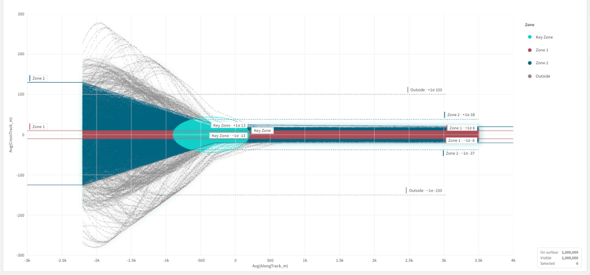
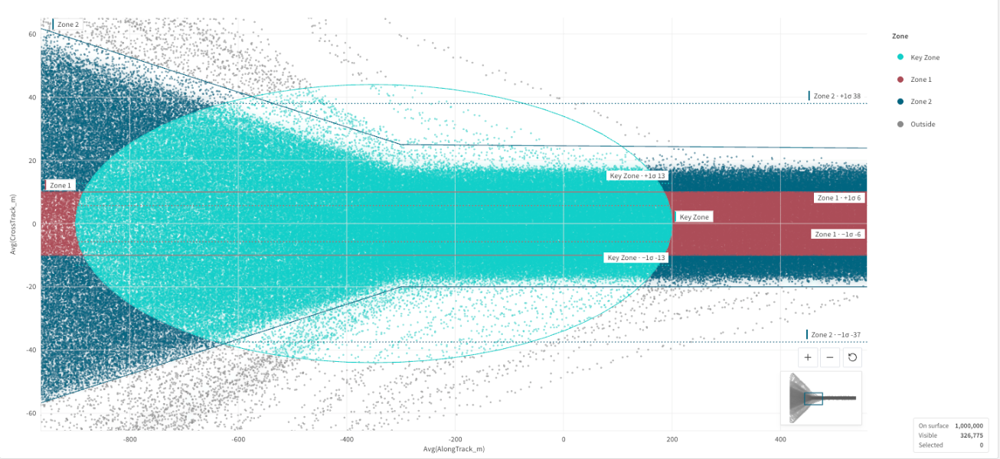
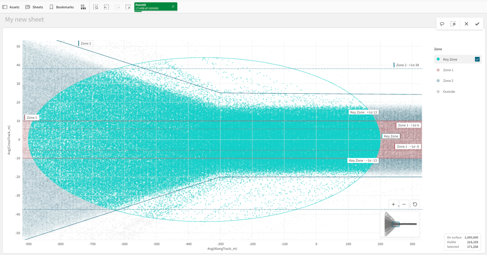
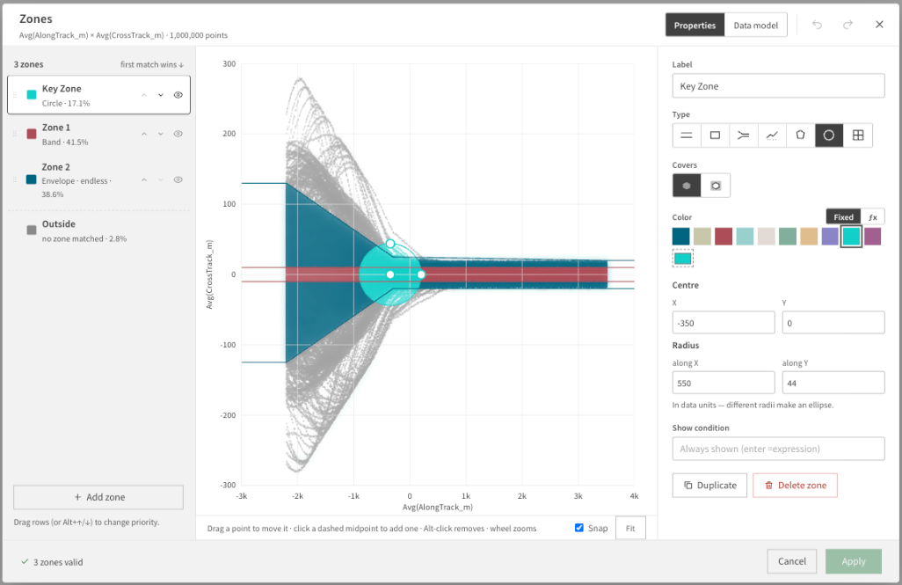
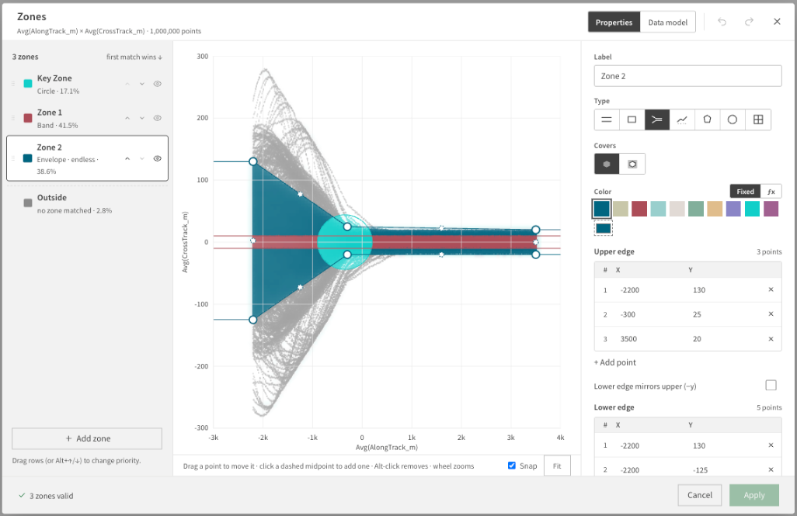
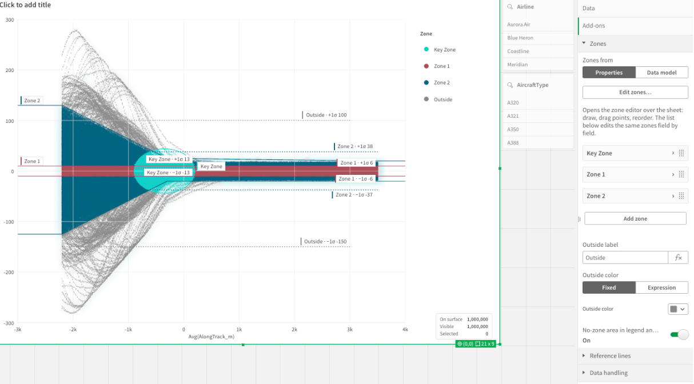

# High Density Scatter for Qlik Sense

**A Qlik Sense scatter plot that draws every point, up to a million of them, and classifies each point into zones you define on the axes.**



_1,000,000 points in a Qlik Cloud app. Every point is drawn; nothing is sampled away. Three zones classify the points (the first match wins), and σ reference lines show the spread._

The native Qlik scatter plot switches to a binned view once there are too many points. qixHighDScatter keeps every point visible and selectable. It is a nebula.js supernova built on the brand-ui `DensityScatterChart`.

## Highlights

- **Up to 1M points, all drawn.** Rendering uses WebGL. Without WebGL, a fast Canvas2D fallback takes over.
- **Zones on the axes.** The zone types are:
  - horizontal band
  - rectangle
  - envelope along X
  - line
  - polygon
  - circle or ellipse
  - quadrants

  Zones form an ordered list, and the first match wins. The legend shows each zone's share of the points.

- **A visual zone editor.** Draw the zones on top of your real data and drag their handles. Any coordinate can also be a Qlik expression.
- **Zones from the data model.** A zone table can drive the zones instead of the properties.
- **Native Qlik selections.** Range, lasso and legend-zone selections become real Qlik selections, with the usual ✓ / ✕ selection toolbar.
- **Deep zoom.** The mouse wheel zooms at the cursor, dragging pans, and a minimap shows where you are.
- **Reference lines.** Average, median and ±σ lines.
- **Shapes by dimension.** Every value of the 2nd dimension can be drawn as its own glyph (circle, square, diamond, triangle up/down, plus, minus, cross, star, hexagon) — on top of the colour. Assign them in the editor's **Shapes** tab.
- **Loading, your way.** A progress bar along the top edge and/or a "n / total" text while the points stream in, or a loading animation that holds the plot back until every point is in.
- **Responsive.** The plot itself never disappears: a small object drops the statistics box, the zone tags, the legend, then the axis titles, then the tick labels — in that order. Legends never wrap: a bottom legend is one line that scrolls sideways, a side legend scrolls vertically.

## Screenshots

### Zoom into the detail

The mouse wheel zooms toward the cursor until individual points separate. The minimap in the corner shows where you are.



### Select a whole zone

Shift-click a zone in the legend. All of its points become a Qlik selection, and every other point is dimmed.



### Zone editor

**Edit zones…** opens the editor over your data. You can reorder the zones, pick a type, and drag the shape on the canvas.



For an envelope, drag the vertices on the canvas or type the points into the table. The lower edge can mirror the upper edge.



### Properties panel

All zone settings are in **Add-ons › Zones**. That includes the source (Properties or Data model), the zone list, and the label and colour for points outside every zone.



## Install (no coding needed)

1. Download `release/qixHighDScatter-v<version>.zip`. Don't unzip it.
2. Upload the zip as an extension:
   - **Qlik Cloud:** Administration › Extensions › Add
   - **Client-managed:** QMC › Extensions › Import
3. In a sheet, click **Edit sheet**. Open **Custom objects** and drag **High Density Scatter** onto the sheet.
4. Add the data:

| Slot                   | What goes there                       | Example            |
| ---------------------- | ------------------------------------- | ------------------ |
| Dimension 1            | The point identity: one row per point | `PointID`          |
| Dimension 2 (optional) | A category to colour by               | `Airline`          |
| Measure 1              | X axis                                | `Only(AlongTrack)` |
| Measure 2              | Y axis                                | `Only(CrossTrack)` |
| Measure 3 (optional)   | Point size                            | `Sum(Weight)`      |
| Measure 4 (optional)   | A value to colour by                  | `Avg(Speed)`       |

By default the chart fetches up to 1,000,000 points. You can raise this to 2,000,000 in **Data handling › Max points fetched**.

## Configure zones

Zones live under **Add-ons › Zones**.

- **From Properties.** Use **Edit zones…** or the list under it. Each zone has:
  - a label
  - a colour, either fixed or an expression
  - a show switch
  - one of the zone types

  Every coordinate accepts an expression, for example `=vCoreLimit`.

  An envelope can mirror its upper edge (−y) to form the lower edge. It can also be endless, continuing past its last point.

- **From Data model.** Map a zone table that has one row per vertex:

  `ZoneID, ZoneLabel, ZoneColor, ZoneEdge (upper | lower | min | max), ZoneSeq, ZoneX, ZoneY`

Points that match no zone fall into **Outside**. You can rename it, recolour it, and choose whether it appears in the legend and can be selected.

## Shapes

**Appearance › Shapes › Shape by dimension** turns it on; **Edit shapes…** (or the **Shapes** tab of the zone editor) lists every value of the 2nd dimension with its glyph. Values you don't assign take the next free glyph in the order they appear in the data. Colour stays whatever it is (zone, dimension or measure); when the legend colours by the same dimension its swatches become the glyphs, otherwise a shape key appears under the plot. Glyphs read best from a point size of about 2.

## Loading

**Appearance › Loading**:

- **While the points load:** _Draw as they arrive_ (the plot fills page by page) or _Loading animation_ (a little robot paints a scatter plot in step with the progress, and every point appears at once when all are in — the fastest way to load large sets).
- **Fun mode** (on by default) uses the robot animation; off shows a plain loading screen (spinner, bar, text).
- **Progress indicator:** bar and text, bar only, text only, or none.

## Interaction

| Action                                   | Result                                                                  |
| ---------------------------------------- | ----------------------------------------------------------------------- |
| Mouse wheel                              | Zoom at the cursor                                                      |
| Drag                                     | Pan                                                                     |
| `+` / `−` / reset buttons                | Zoom in, zoom out, reset the view                                       |
| Range tool                               | Box-select X and Y together. Drag in an axis gutter to select one axis. |
| Lasso tool                               | Select the points inside a freehand shape                               |
| Click a legend entry                     | Hide or show that zone                                                  |
| Shift-click or Ctrl-click a legend entry | Select every point in that zone                                         |

Selections are real Qlik selections:

- Ranges and boxes use `rangeSelectHyperCubeValues` on the two measures.
- Lassos and envelope zones become up to 64 vertical strips, sent with `multiRangeSelectHyperCubeValues`. The native scatter plot selects the same way.

## Performance

- **Packed transport** (default, _Data handling › Transport_): the chart asks the engine for a session cube whose one measure bundles the points as compact text (`id⇥x⇥y…`, about 25 bytes per point, in ~1,000 hash buckets) instead of reading the chart's own table, which costs ~62 bytes per _cell_ on the wire. On Qlik Cloud 1M points now take about 6–8 s (4–6 s for the engine to build the cube, ~1.5 s to transfer) instead of 20 s; 200k points about 2 s instead of 4. In _Draw as they arrive_ mode a light preview of the plain table fills the picture while the engine packs. Packing needs field (not calculated) dimensions and at most two of them; otherwise, or with _Plain paging_ selected, the chart pages the table as before.
- **Selections on a cached load**: when the point dimension has one data row per value, the first full load is kept, and a later selection only asks the engine for the list of possible ids (a quarter of the bytes) and cuts the cached points locally — typically 0.5–2 s for any selection, instead of a full reload. An app reload invalidates the cache.
- Pan and zoom stay smooth with WebGL; without a GPU the chart drops to a coarser level of detail while you interact and refines when you stop.
- If the chart feels sluggish, check that the browser's hardware acceleration is on (the small orange sign near the legend says where). Without it, the chart falls back to the slower Canvas2D renderer.
- Diagnostics: the console line `[qixHighDScatter] loaded …` breaks down each load; `window.__qhdsPerf.load` holds the same numbers.

## Develop

```bash
npm install
npm run build        # → extension/qixHighDScatter/ (AMD bundle, qext, stubs)
npm run package      # → release/qixHighDScatter-v<version>.zip
node test/run-harness.mjs "?n=300000"   # real nebula.js runtime + EnigmaMocker in Chromium
node test/selection-test.mjs            # drives range / lasso / legend, records engine calls
node test/editor-test.mjs               # zone editor
node test/wheel-longtask.mjs            # wheel-zoom frame times
```

Setting `BRAND_UI_SRC=<elabs-components>/packages` builds against the brand-ui source instead of the published packages.

**Until brand-ui ships `DensityScatterChart.shapeBy` on npm (it lives on the `feat/density-scatter-shape-by` branch of `mreimitz/elabs-components`), build against that source:**

```bash
git clone -b feat/density-scatter-shape-by https://github.com/mreimitz/elabs-components ../elabs-components
(cd ../elabs-components && pnpm install)
BRAND_UI_SRC=../elabs-components/packages npm run build
```

### Build notes

- `@nebula.js/stardust` is the only external. React, brand-ui and their dependencies are bundled.
- The brand-ui Tailwind CSS is compiled and then scoped to `.qhds`: cascade layers are unwrapped and `@font-face` rules are dropped. It is injected once.
- Colours, fonts, grid and surfaces come from the Qlik app theme (`src/theme.ts`).

Design and decisions are in [`research/CONCEPT.md`](research/CONCEPT.md). A load script for the test data is in [`research/test-data.qvs`](research/test-data.qvs).
